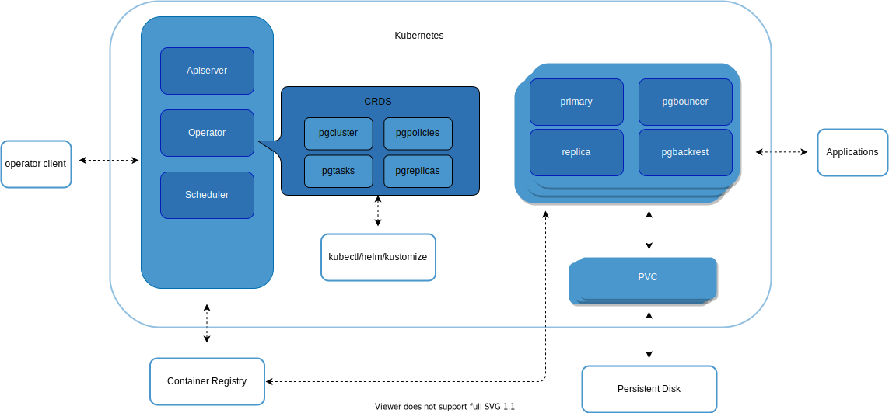

# 

> [English](README.md) | 中文

----

## 什么是 RadonDB PostgreSQL

[RadonDB PostgreSQL](https://github.com/CrunchyData/postgres-operator) 是基于 `PostgreSQL` 的开源、高可用、云原生集群解决方案。

RadonDB PostgreSQL 支持在 `Kubernetes` 和 `KubeSphere` 平台部署。

## 架构图



## 核心功能

* 轻松创建、扩展及删除PostgreSQL集群
* 高可用
  * 基于分布式共识的高可用解决方案，支持故障自动转移
  * 支持跨Kubernetes集群部署备用集群

* 灾难恢复
  * 备份和恢复基于开源的[pgBackRest][]，支持全量、增量和差异增量备份，支持增量恢复，可自定义备份保留时长

* 监控

  使用开源的[pgMonitor][]监控集群的运行情况

* 支持同步/异步复制
* 支持从现有集群克隆创建新的集群
* 使用`pgBouncer`连接池
* 计划备份
  * 支持自定义备份时间策略
  * 支持全量、增量、差异增量备份
  * 支持备份到本地存储或任何支持S3协议的对象存储，如`QingStor` 对象存储

除上述功能之外，地理空间增强的PostgreSQL + PostGIS容器还增加了如下组件：

* [PostGIS](http://postgis.net/)

* [pgRouting](https://pgrouting.org/)

PostgreSQL Operator Monitoring]使用如下组件

- [pgMonitor](https://github.com/CrunchyData/pgmonitor)
- [Prometheus](https://github.com/prometheus/prometheus)
- [Grafana](https://github.com/grafana/grafana)
- [Alertmanager](https://github.com/prometheus/alertmanager)

## 快速入门

### 部署operator

`kubectl apply -f https://raw.githubusercontent.com/radondb/radondb-postgresql-operator/main/installers/kubectl/postgres-operator.yml`

### 安装pgo客户端

`curl https://raw.githubusercontent.com/radondb/radondb-postgresql-operator/main/installers/kubectl/client-setup.sh`

`chmod +x client-setup.sh`

`./client-setup.sh`

```shell
cat <<EOF >> ~/.bashrc
export PGOUSER="${HOME?}/.pgo/pgo/pgouser"
export PGO_CA_CERT="${HOME?}/.pgo/pgo/client.crt"
export PGO_CLIENT_CERT="${HOME?}/.pgo/pgo/client.crt"
export PGO_CLIENT_KEY="${HOME?}/.pgo/pgo/client.key"
export PGO_APISERVER_URL='https://127.0.0.1:8443'
export PGO_NAMESPACE=pgo
EOF
source ~/.bashrc
```

### 部署PG集群

```shell
pgo create cluster hippo
```


## 协议

RadonDB PostgreSQL 基于 Apache 2.0 协议，详见 [LICENSE](./LICENSE)。

<p align="center">
<br/><br/>
如有任何关于 RadonDB PostgreSQL 的问题或建议，请在 GitHub 提交 Issue 反馈。
<br/>
</a>
</p>