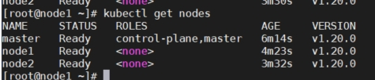
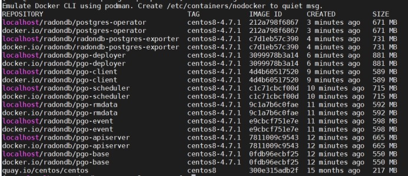
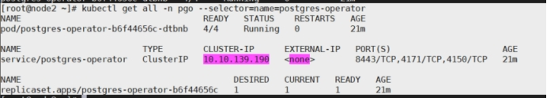
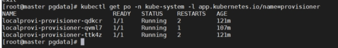
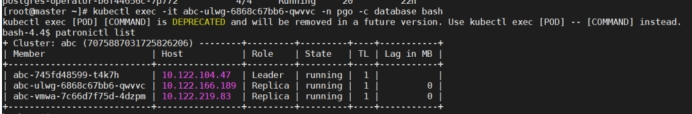

# **基本环境**

操作系统版本：centos7

| 主机名 | IP            | 角色       | 备注     |
| ------ | ------------- | ---------- | -------- |
| master | 192.168.137.2 | k8s master | 去除污点 |
| node1  | 192.168.137.3 | k8s node   |          |
| node2  | 192.168.137.4 | k8s node   |          |

 

## **操作系统环境**

```
#1、修改各自主机名并修改主机列表

 

#192.168.137.2

vi /etc/hostname

master

cat >> /etc/hosts << EOF

192.168.137.2 master

192.168.137.3 node1

192.168.137.4 node2

EOF

 

#192.168.137.3

vi /etc/hostname

node1

cat >> /etc/hosts << EOF

192.168.137.2 master

192.168.137.3 node1

192.168.137.4 node2

EOF

#192.168.137.4

vi /etc/hostname

node2

cat >> /etc/hosts << EOF

192.168.137.2 master

192.168.137.3 node1

192.168.137.4 node2

EOF

#2、关闭防火墙

systemctl stop firewalld && systemctl disable firewalld

#3、关闭selinux

sed -i 's/enforcing/disabled/' /etc/selinux/config && setenforce 0

#4、关闭swap

swapoff -a && sed -ri 's/.*swap.*/#&/' /etc/fstab

#5、时间同步

yum install ntpdate -y && ntpdate time.windows.com

\#6、配置内核参数，将桥接的IPv4流量传递到iptables的链

cat > /etc/sysctl.d/k8s.conf <<EOF

net.bridge.bridge-nf-call-ip6tables = 1

net.bridge.bridge-nf-call-iptables = 1

EOF

sysctl --system
```

## **docker**

```
# step 1: 安装必要的一些系统工具

yum install -y yum-utils device-mapper-persistent-data lvm2

# Step 2: 添加软件源信息

yum-config-manager --add-repo https://mirrors.aliyun.com/docker-ce/linux/centos/docker-ce.repo

# Step 3: 更新并安装Docker-CE

yum makecache fast

yum -y install docker-ce

# Step 4: 开启Docker服务

systemctl start docker && systemctl enable docker

 

# 可以通过修改daemon配置文件/etc/docker/daemon.json来使用加速器

mkdir -p /etc/docker

tee /etc/docker/daemon.json <<-'EOF'

{

 "registry-mirrors": ["https://s2q9fn53.mirror.aliyuncs.com"]

}

EOF

systemctl daemon-reload && sudo systemctl restart docker
```

 

## **Kubernetes**

### **初始化**

```
#添加kubernetes阿里YUM源

cat <<EOF > /etc/yum.repos.d/kubernetes.repo

[kubernetes]

name=Kubernetes

baseurl=https://mirrors.aliyun.com/kubernetes/yum/repos/kubernetes-el7-x86_64/

enabled=1

gpgcheck=1

repo_gpgcheck=0

gpgkey=https://mirrors.aliyun.com/kubernetes/yum/doc/yum-key.gpg https://mirrors.aliyun.com/kubernetes/yum/doc/rpm-package-key.gpg

EOF

yum install kubectl-1.20.0 kubelet-1.20.0 kubeadm-1.20.0

 && systemctl enable kubelet && systemctl start kubelet

 

#初始化集群

#master

kubeadm init --kubernetes-version=1.20.0  \

--apiserver-advertise-address=192.168.137.2  \

--image-repository registry.aliyuncs.com/google_containers  \

--service-cidr=10.10.0.0/16 --pod-network-cidr=10.122.0.0/16

 
```

 

```
mkdir -p $HOME/.kube

cp -i /etc/kubernetes/admin.conf $HOME/.kube/config

chown $(id -u):$(id -g) $HOME/.kube/config

 

#其他节点加入集群

kubeadm join 192.168.137.2:6443 --token scw8xm.x5y7fck1via4mwc2 \

  --discovery-token-ca-cert-hash sha256:8944421887121b6a2ac32987d9d1c7786fe64316cebdf7a63b6048fba183cc67
```


### **部署CNI网络插件**

```
#安装flannel网络插件

kubectl apply -f https://docs.projectcalico.org/manifests/calico.yaml

#发送admin.conf到所有节点，可以在任何一个节点管理集群

scp /etc/kubernetes/admin.conf root@node1:/etc/kubernetes/admin.conf

scp /etc/kubernetes/admin.conf root@node2:/etc/kubernetes/admin.conf

#在node节点上加入环境变量

echo "export KUBECONFIG=/etc/kubernetes/admin.conf" >> /etc/profile

source /etc/profile

#执行完成以后可以在任意node节点上管理集群，查看节点是否正常

kubectl get nodes
```

 

 

 

### **查看节点**

```
[root@node2 images]# kubectl label node node1 node-role.kubernetes.io/worker=worker

node/node1 labeled

[root@node2 images]# kubectl label node node2 node-role.kubernetes.io/worker=worker

node/node2 labeled
```


### **创建默认storageclass**

```
vi sc.yml

kind: StorageClass

apiVersion: storage.k8s.io/v1

metadata:

 name: fast-disks

provisioner: kubernetes.io/no-provisioner

volumeBindingMode: WaitForFirstConsumer

[root@master ~]# kubectl apply -f sc.yml

storageclass.storage.k8s.io/local-storage create

#设置为默认

kubectl patch storageclass fast-disks -p '{"metadata": {"annotations":{"storageclass.kubernetes.io/is-default-class":"true"}}}'
```


### **去除污点**

```
#添加 尽量不调度 PreferNoSchedule 

kubectl taint nodes master node-role.kubernetes.io/master:PreferNoSchedule

#去除污点NoSchedule，最后一个"-"代表删除

kubectl taint nodes master node-role.kubernetes.io/master:NoSchedule-
```

 

# **编译**

## **操作系统版本**

CentOS-Stream-8-x86_64

## **依赖安装**

```
yum install golang

[root@localhost ~]# go version

go version go1.17.7 linux/amd64

yum install git

[root@localhost ~]# buildah version

Version:     1.23.1

Go Version:    go1.16.7

Image Spec:    1.0.1-dev

Runtime Spec:   1.0.2-dev

CNI Spec:     0.4.0

libcni Version:  v0.8.1

image Version:  5.16.0

Git Commit:

Built:      Wed Oct 20 00:11:43 2021

OS/Arch:     linux/amd64

BuildPlatform:  linux/amd64

yum install make

yum install podman-docker

systemctl start podman

systemctl enable podman
```


## **下载源码**

```
github clone https://github.com/radondb/radondb-postgresql-operator
```


## **设置环境变量**

```
[root@localhost ~]# echo "export GO111MODULE=on" >> ~/.profile

[root@localhost ~]# echo "export GOPROXY=https://goproxy.cn" >> ~/.profile

[root@localhost ~]# source ~/.profile
```

 

## **修改Dockerfile**

修改pgo-base的dockerfile源文件

```
RUN sed -e "s|^mirrorlist=|#mirrorlist=|g" \

-e "s|^#baseurl=http://mirror.centos.org/\$contentdir/\$releasever|baseurl=https://mirrors.tuna.tsinghua.edu.cn/centos-vault/8.5.2111|g" \

-i.bak \

/etc/yum.repos.d/CentOS-*.repo
```


## **编译docker镜像**

```
make setup #安装相关依赖，包括exporter和pgmonitor

make #编译镜像
```

 

导出镜像文件

示例：

```
docker save -o centos.tar.gz quay.io/centos/centos:centos8-4.7
```

导入镜像文件

示例：

```
docker load -i centos.tar.gz
```

# **使用**

## **环境**

### **安装Helm**

```
cp helm /usr/local/bin/
```

### **安装PGO**

```
cp pgo /usr/local/bin/
```

### **导入镜像**

```
cd images

docker load -i centos.tar.gz

docker load -i pgo-base.tar.gz

docker load -i pgo-deployer.tar.gz

docker load -i pgo-apiserver.tar.gz

docker load -i pgo-client.tar.gz

docker load -i pgo-event.tar.gz

docker load -i pgo-rmdata.tar.gz

docker load -i pgo-scheduler.tar.gz

docker load -i postgres-operator.tar.gz

docker load -i radondb-postgres-exporter.tar.gz
```

### **安装存储**

1. 添加新硬盘

2. 重启虚拟机

   查看现有系统的磁盘空间

```
 fdisk -l
```

   可看到新加的虚拟硬盘，一般名为： Disk /dev/sdb

3. 给新加的硬盘分区

```
 fdisk /dev/sdb
```

增加新分区

选择基本分区，输入： p

```
 Partition number(1-4):1 

 First cylinder (1-15908,default 1):Enter

 command (m for help):w
```

4. 格式化磁盘分区

   用 ext4格式对/dev/sdb1进入格式化

```
 mkfs.ext4 /dev/sdb1
```

5. 挂载分区

   创建新的挂载点

```
 mkdir -p /data/pgdata/pv1
```

   将新磁盘分区挂载到 /work目录下

```
 mount -t ext4 /dev/sdb1 /data/pgdata/pv1
```

   查看挂载

```
 df -h
```

   可以看到新加的硬盘： /dev/sdb1

6. 开机自动挂载

   修改文件

```
 vim /etc/fstab
```

   在最后一行加入：

```
 /dev/sdb1 /data/pgdata/ ext4 errors=remount-ro 0 1
```

### **创建命名空间**

```
kubectl create namespace pgo
```

### **创建部署文件**

```
apiVersion: v1

kind: ServiceAccount

metadata:

 name: pgo-deployer-sa

 namespace: pgo

 labels:

  vendor: radondb

---

kind: ClusterRole

apiVersion: rbac.authorization.k8s.io/v1

metadata:

 name: pgo-deployer-cr

 labels:

  vendor: radondb

rules:

 - apiGroups:

   - ''

  resources:

   - namespaces

  verbs:

   - get

   - list

   - create

   - patch

   - delete

 - apiGroups:

   - ''

  resources:

   - pods

  verbs:

   - list

 - apiGroups:

   - ''

  resources:

   - secrets

  verbs:

   - list

   - get

   - create

   - delete

   - patch

 - apiGroups:

   - ''

  resources:

   - configmaps

   - services

   - persistentvolumeclaims

  verbs:

   - get

   - create

   - delete

   - list

   - patch

 - apiGroups:

   - ''

  resources:

   \- serviceaccounts

  verbs:

   - get

   - create

   - delete

   - patch

   - list

 - apiGroups:

   - apps

   - extensions

  resources:

   - deployments

   - replicasets

  verbs:

   - get

   - list

   - watch

   - create

   - delete

 - apiGroups:

   - apiextensions.k8s.io

  resources:

   - customresourcedefinitions

  verbs:

   - get

   - create

   - delete

 - apiGroups:

   - rbac.authorization.k8s.io

  resources:

   - clusterroles

   - clusterrolebindings

   - roles

   - rolebindings

  verbs:

   - get

   - create

   - delete

   - bind

   - escalate

 - apiGroups:

   - rbac.authorization.k8s.io

  resources:

   - roles

  verbs:

   - create

   - delete

 - apiGroups:

   - batch

  resources:

   - jobs

  verbs:

   - delete

   - list

 - apiGroups:

   - radondb.com

  resources:

   - pgclusters

   - pgreplicas

   - pgpolicies

   - pgtasks

  verbs:

   - delete

   - list

---

apiVersion: v1

kind: ConfigMap

metadata:

 name: pgo-deployer-cm

 namespace: pgo

 labels:

  vendor: radondb

data:

 values.yaml: |-

  # =====================

  # Configuration Options

  # More info for these options can be found in the docs

  # =====================

  archive_mode: "true"

  archive_timeout: "60"

  backrest_aws_s3_bucket: ""

  backrest_aws_s3_endpoint: ""

  backrest_aws_s3_key: ""

  backrest_aws_s3_region: ""

  backrest_aws_s3_secret: ""

  backrest_aws_s3_uri_style: ""

  backrest_aws_s3_verify_tls: "true"

  backrest_gcs_bucket: ""

  backrest_gcs_endpoint: ""

  backrest_gcs_key_type: ""

  backrest_port: "2022"

  badger: "false"

  ccp_image_prefix: "docker.io/radondb"

  ccp_image_pull_secret: ""

  ccp_image_pull_secret_manifest: ""

  ccp_image_tag: "centos8-13.3-4.7.1"

  create_rbac: "true"

  radondb_debug: "false"

  db_name: ""

  db_password_age_days: "0"

  db_password_length: "24"

  db_port: "5432"

  db_replicas: "0"

  db_user: "testuser"

  default_instance_memory: "128Mi"

  default_pgbackrest_memory: "48Mi"

  default_pgbouncer_memory: "24Mi"

  default_exporter_memory: "24Mi"

  delete_operator_namespace: "false"

  delete_watched_namespaces: "false"

  disable_auto_failover: "false"

  reconcile_rbac: "true"

  exporterport: "9187"

  metrics: "true"

  namespace: "pgo"

  namespace_mode: "dynamic"

  pgbadgerport: "10000"

  pgo_add_os_ca_store: "false"

  pgo_admin_password: "examplepassword"

  pgo_admin_perms: "*"

  pgo_admin_role_name: "pgoadmin"

  pgo_admin_username: "admin"

  pgo_apiserver_port: "8443"

  pgo_apiserver_url: "https://postgres-operator"

  pgo_client_cert_secret: "pgo.tls"

  pgo_client_container_install: "true"

  pgo_client_install: "true"

  pgo_client_version: "4.7.1"

  pgo_cluster_admin: "false"

  pgo_disable_eventing: "false"

  pgo_disable_tls: "false"

  pgo_image_prefix: "docker.io/radondb"

  pgo_image_pull_secret: ""

  pgo_image_pull_secret_manifest: ""

  pgo_image_tag: "centos8-4.7.1"

  pgo_installation_name: "devtest"

  pgo_noauth_routes: ""

  pgo_operator_namespace: "pgo"

  pgo_tls_ca_store: ""

  pgo_tls_no_verify: "false"

  pod_anti_affinity: "preferred"

  pod_anti_affinity_pgbackrest: ""

  pod_anti_affinity_pgbouncer: ""

  scheduler_timeout: "3600"

  service_type: "ClusterIP"

  sync_replication: "false"

  backrest_storage: "default"

  backup_storage: "default"

  primary_storage: "default"

  replica_storage: "default"

  pgadmin_storage: "default"

  wal_storage: ""

  storage1_name: "default"

  storage1_access_mode: "ReadWriteOnce"

  storage1_size: "1G"

  storage1_type: "dynamic"

  storage2_name: "hostpathstorage"

  storage2_access_mode: "ReadWriteMany"

  storage2_size: "1G"

  storage2_type: "create"

  storage3_name: "nfsstorage"

  storage3_access_mode: "ReadWriteMany"

  storage3_size: "1G"

  storage3_type: "create"

  storage3_supplemental_groups: "65534"

  storage4_name: "nfsstoragered"

  storage4_access_mode: "ReadWriteMany"

  storage4_size: "1G"

  storage4_match_labels: "radondbzone=red"

  storage4_type: "create"

  storage4_supplemental_groups: "65534"

  storage5_name: "storageos"

  storage5_access_mode: "ReadWriteOnce"

  storage5_size: "5Gi"

  storage5_type: "dynamic"

  storage5_class: "fast-disks"

  storage6_name: "primarysite"

  storage6_access_mode: "ReadWriteOnce"

  storage6_size: "4G"

  storage6_type: "dynamic"

  storage6_class: "primarysite"

  storage7_name: "alternatesite"

  storage7_access_mode: "ReadWriteOnce"

  storage7_size: "4G"

  storage7_type: "dynamic"

  storage7_class: "alternatesite"

  storage8_name: "gce"

  storage8_access_mode: "ReadWriteOnce"

  storage8_size: "300M"

  storage8_type: "dynamic"

  storage8_class: "standard"

  storage9_name: "rook"

  storage9_access_mode: "ReadWriteOnce"

  storage9_size: "1Gi"

  storage9_type: "dynamic"

  storage9_class: "rook-ceph-block"

---

apiVersion: rbac.authorization.k8s.io/v1

kind: ClusterRoleBinding

metadata:

 name: pgo-deployer-crb

 labels:

  vendor: radondb

roleRef:

 apiGroup: rbac.authorization.k8s.io

 kind: ClusterRole

 name: pgo-deployer-cr

subjects:

 - kind: ServiceAccount

  name: pgo-deployer-sa

  namespace: pgo

---

apiVersion: batch/v1

kind: Job

metadata:

 name: pgo-deploy

 namespace: pgo

 labels:

  vendor: radondb

spec:

 backoffLimit: 0

 template:

  metadata:

   name: pgo-deploy

   labels:

     vendor: radondb

  spec:

   serviceAccountName: pgo-deployer-sa

   restartPolicy: Never

   containers:

     - name: pgo-deploy

      image: docker.io/radondb/pgo-deployer:centos8-4.7.1

      imagePullPolicy: IfNotPresent

      env:

        - name: DEPLOY_ACTION

        value: install

      volumeMounts:

        - name: deployer-conf

        mountPath: "/conf"

   volumes:

     - name: deployer-conf

      configMap:

       name: pgo-deployer-cm
```

### **部署PostgreSQL Operator**

```
kubectl apply -f postgres-operator.yml
```

### **查看PostgreSQL Operator**

#### **通过原生kubectl工具**

```
kubectl get all -n pgo --selector=name=postgres-operator
```

 

## **部署步骤**

说明：本示例存储采用hostpath方式。

### **安装存储驱动**

```
git clone https://github.com/kubernetes-sigs/sig-storage-local-static-provisioner.git 

cd sig-storage-local-static-provisioner 

# 

vi helm/provisioner/values.yaml 

classes: 

- name: fast-disks 

hostDir: /data/pgdata 

volumeMode: Filesystem 

fsType: ext4

116 image: quay.io/external_storage/local-volume-provisioner:v2.4.0 

# 

helm install localprovi . -n kube-system 

#podpv 

kubectl get po -n kube-system -l app.kubernetes.io/name=provisioner
```

 

```
kubectl get pv -n pgo |grep ^local
```

 

### **安装 PGO 客户端**

```
curl https://raw.githubusercontent.com/radondb/radondb-postgresql-operator/main/installers/kubectl/client-setup.sh |bash
```

替换本地operator文件

设置环境变量，使其正常工作。

```
vi ~/.bashrc

export PATH=/root/.pgo/pgo:$PATH

export PGOUSER=/root/.pgo/pgo/pgouser

export PGO_CA_CERT=/root/.pgo/pgo/client.crt

export PGO_CLIENT_CERT=/root/.pgo/pgo/client.crt

export PGO_CLIENT_KEY=/root/.pgo/pgo/client.key

export PGO_APISERVER_URL='https://127.0.0.1:8443'

export PGO_NAMESPACE=pgo

source ~/.bashrc
```

### **转发****请求**

 转发svc/postgres-operator 到本地。

```
nohup kubectl port-forward --namespace pgo svc/postgres-operator 8443:8443  &>/dev/null &
```

### **部署集群**

启用 PGO 客户端，创建集群。

```
pgo create cluster radondb
```

设置部署参数。部分参数可参见下表，并可执行 pgo 命令行帮助获取更详细的部署参数帮助。

```
pgo --help
```

| ***\*命令行\****                                             | ***\*命令说明\****                                           |
| ------------------------------------------------------------ | ------------------------------------------------------------ |
| --pgbackrest-storage-type="s3" \                             | 备份存储的类型。支持 posix 、s3、gcs、posix,s3 和 posix,gcs五种类型。 |
| --replica-count=3 \                                          | PostgeSQL副本数量。                                          |
| --ccp-image=radondb-postgres-ha \                            | 使用的镜像名称。 带 gis 插件的镜像，例如 radondb-postgres-gis-ha。 不带 gis 插件的镜像，例如 radondb-postgres-ha。 |
| --ccp-image-prefix=docker.io/radondb \                       | 镜像仓库。                                                   |
| --ccp-image-tag=centos8-13.3-4.7.1 \                         | ockerhub 上镜像的标签。目前支持 centos8-12.7-4.7.1 和 centos8-13.3-4.7.1。 |
| --pgbackrest-s3-endpoint=s3.pek3b.qingstor.com \ --pgbackrest-s3-key=xxxxx \ --pgbackrest-s3-key-secret=xxxx \ --pgbackrest-s3-bucket=xxxx \ --pgbackrest-s3-region=xxx \ --pgbackrest-s3-verify-tls=false \ | 支持 s3 协议的对象存储设置，主要用于备份。若备份存储选择了 s3 则需要设置这部分参数。 |
| --metrics \                                                  | 启用适用于 [Prometheus](https://prometheus.io/) 的指标收集器。 |
| --pgbadger \                                                 | 启用 pgbadger。                                              |
| --debug                                                      | 调试模式。                                                   |

执行以下命令观察集群创建过程。待所有 Pod 状态切换为 Running，则集群创建完成。

```
kubectl get po -n pgo --watch
```

## ***\*连接RadonDB PostgreSQL集群\****

执行 

```
pgo show user -n pgo radondb
```

 命令，获取集群中用户账号信息。

以下以 radondb 集群为示例，获取数据库账号并连接数据库。

```
 pgo show user -n pgo radondb --show-system-accounts

 CLUSTER  USERNAME    PASSWORD         EXPIRES STATUS ERROR 

--------- -------------- ------------------------ ------- ------ -----

radondb ccp_monitoring Dwpa|MCg,b4M+rY.>ZC0ONz4 never  ok        

radondb postgres    1a4R-d7Po=,PS@R:-=?[gP(9 never  ok      

radondb primaryuser   =B8x*Haf*dCq+V4hkGSfh/.} never  ok      

radondb testuser    yTFeeH1|^DX<Bx4[?:B_/Q;M never  ok 
```

### ***\*通过 psql 连接\****

查看服务

```
kubectl -n pgo get svc

NAME               TYPE     CLUSTER-IP    EXTERNAL-IP  PORT(S)                 AGE

postgres-operator         ClusterIP  10.96.64.37   <none>     8443/TCP,4171/TCP,4150/TCP       58m

radondb             ClusterIP  10.96.171.227  <none>     10000/TCP,9187/TCP,2022/TCP,5432/TCP  5m42s

radondb-backrest-shared-repo  ClusterIP  10.96.235.247  <none>     2022/TCP                5m42s

radondb-pgbouncer        ClusterIP  10.96.234.49   <none>     5432/TCP                4m16s

radondb-replica         ClusterIP  10.96.67.45   <none>     10000/TCP,9187/TCP,2022/TCP,5432/TCP  3m50s
```

以 testuser 账号为示例，连接到数据库。

```
kubectl -n pgo port-forward svc/radondb 5432:5432 

PGPASSWORD='yTFeeH1|^DX<Bx4[?:B_/Q;M' psql -h localhost -p 5432 -U testuser radondb
```

# **查看集群**

kubectl exec -it rp1-65798ccf5c-ftbp9 -n pgo -c database bash

 

**可以看到图中为3节点patroni集群，至此，Postgresql云数据库版本搭建完成。**